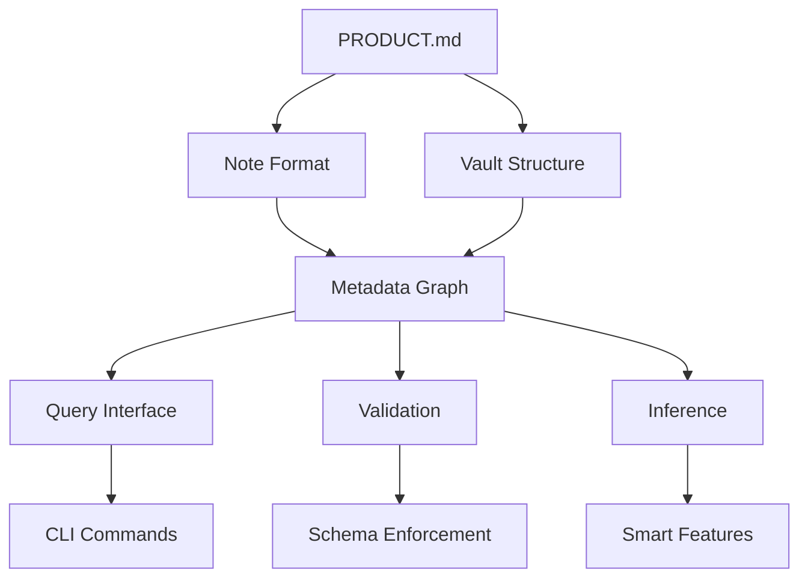

# kbase Specification Reading Guide

This guide provides the recommended order for reading the kbase specifications to build a complete mental model of the system.

## 🎯 Quick Start (10 minutes)

For a high-level overview:
1. **PRODUCT.md** - Overall vision and requirements
2. **contracts/note-format.md** - How notes are structured
3. **features/vault-init.md** - How vaults work

## 📚 Comprehensive Understanding (Recommended Order)

### 1. Foundation
- **PRODUCT.md** - Product vision, target users, core concepts
- **SPEC-GUIDE.md** - How to read and write specs (meta)

### 2. Data Model
- **contracts/note-format.md** - Note file format specification
- **features/metadata-graph.md** - How metadata becomes a graph
- **contracts/plugin-api.md** - Extension points (future)

### 3. Core Features
- **features/vault-init.md** - Vault initialization
- **features/note-crud.md** - Create, read, update, delete notes
- **features/search-query.md** - Search and query capabilities

### 4. Advanced Features
- **features/metadata-graph.md** - Graph operations and queries
- **research/ontology.md** - Ontology modeling approaches
- **research/inference.md** - Inference strategies
- **research/validation.md** - Validation approaches

### 5. Implementation Research
- **research/languages.md** - Language options analysis
- **research/graph-databases.md** - Database options comparison
- **decisions/ADR-001-stack.md** - Technology stack decision

## 🔍 Reference Architecture

## 🎯 Key Concepts Map

| Concept | Defined In | Related To |
|---------|-----------|------------|
| Vault | PRODUCT.md, vault-init.md | .kbase/, config, schema |
| Note | note-format.md | Frontmatter, UUID, Markdown |
| Graph | metadata-graph.md | Triples, SPARQL/Datalog, Ontology |
| Ontology | ontology.md | RDFS, OWL, Class hierarchies |
| Inference | inference.md | Reasoning, Automatic relationships |
| Validation | validation.md | SHACL, Constraints, Schema |
| Embeddings | PRODUCT.md | Similarity search, Vector space |

## 📋 Specification Maturity Levels

| Document | Status | Implementation |
|----------|--------|----------------|
| PRODUCT.md | ✅ Complete | ❌ Not started |
| note-format.md | ✅ Complete | ❌ Not started |
| vault-init.md | ✅ Complete | ❌ Not started |
| note-crud.md | ✅ Complete | ❌ Not started |
| search-query.md | ✅ Complete | ❌ Not started |
| metadata-graph.md | ✅ Complete | ❌ Not started |
| plugin-api.md | ⚠️ Draft | ❌ Deferred |
| ontology.md | ✅ Complete | ❌ Not started |
| inference.md | ✅ Complete | ❌ Not started |
| validation.md | ✅ Complete | ❌ Not started |
| languages.md | ✅ Complete | ❌ Not started |
| graph-databases.md | ✅ Complete | ❌ Not started |
| ADR-001-stack.md | ✅ Complete | ❌ Not started |

## 💡 Reading Tips

1. **Start with PRODUCT.md** - This gives the big picture
2. **Follow the data flow** - Notes → Graph → Queries → Features
3. **Check cross-references** - Most docs link to related specifications
4. **Use the maturity table** - Focus on complete specs first
5. **Refer to this guide** - When you get lost, come back here

## 🎓 Learning Paths

### For Developers
1. PRODUCT.md → languages.md → graph-databases.md → ADR-001-stack.md
2. note-format.md → metadata-graph.md → search-query.md
3. Implementation specs for your chosen stack

### For Users
1. PRODUCT.md → vault-init.md → note-crud.md
2. search-query.md → metadata-graph.md (advanced)
3. ontology.md (if interested in smart features)

### For Researchers
1. ontology.md → inference.md → validation.md
2. graph-databases.md → languages.md
3. Compare with existing knowledge management systems

## 🔗 Quick Reference

- **CLI Commands**: See PRODUCT.md "Core Operations" section
- **File Formats**: note-format.md and .kbase/ structure in PRODUCT.md
- **Query Examples**: search-query.md and metadata-graph.md
- **Advanced Features**: ontology.md, inference.md, embeddings in PRODUCT.md

This reading guide should help you navigate the specifications systematically and build a complete mental model of kbase!